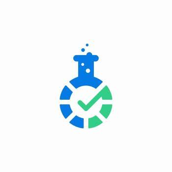

<div align="center">



# Muhammad Taha Khurram — QA Engineer Portfolio

**Quality engineering that drives excellence.**

A professional portfolio website showcasing expertise in Software Quality Assurance — manual testing, automation, API & performance testing, and QA consultation.


**live** [mtahalabs.netlify.app](https://mtahalabs.netlify.app)

</div>

---

## ✨ Highlights

- 🧪 **Five QA services** — Manual Testing, Automation Testing, API Testing, Performance Testing, and Security Testing, each with a dedicated breakdown.
- 👤 **Full portfolio experience** — Home, About, Services, Portfolio, and Contact pages sharing a consistent navbar, header, and footer.
- 📈 **Proven results** — headline metrics (15+ projects, 3K+ test cases, 85% automation coverage, 95% defect detection) surfaced on the Services page.
- 🗂️ **Project showcase** — deep-dive case studies for **SEO Master** and **Time Center E-Commerce**, each on its own route.
- 📬 **Working contact form** — server-side validated form wired to email via Flask-Mail (Mailtrap SMTP) in the Flask app, with a dedicated thank-you page.
- ⚙️ **Static-site pipeline** — a `build.py` generator renders the Jinja2 templates to plain HTML in `dist/` for Netlify, mocking Flask's `url_for`/`request` so templates stay portable.
- 🚀 **One-command deploy** — Netlify runs `python build.py`, publishes `dist/`, and applies clean-URL redirects plus caching & security headers.
- 🔁 **Dual runtime** — run the Flask app locally for the live contact form, or build the fully static export for hosting.

## 🛠️ Tech Stack

- **Frontend:** HTML5, CSS3, JavaScript (per-page CSS/JS modules)
- **Templating:** Jinja2 (shared `partials/` for header, navbar, footer)
- **Backend:** Flask + Flask-Mail (local contact form)
- **Build:** `build.py` static site generator → `dist/`
- **Deployment:** Netlify (static) · Gunicorn `Procfile` for server hosting

## 📁 Project Structure

```
SQA_Portfolio/
├── templates/                 # Jinja2 HTML templates
│   ├── partials/              # Reusable components (header, navbar, footer)
│   ├── home.html
│   ├── about.html
│   ├── services.html
│   ├── portfolio.html
│   ├── contact.html
│   ├── thank-you.html
│   ├── seo_helper_master.html
│   └── time_center_ecommerce.html
├── static/
│   ├── css/                   # Per-page stylesheets
│   ├── js/                    # Per-page scripts + loader
│   ├── images/                # Images and assets
│   ├── files/                 # Downloadable CV
│   └── _redirects             # Netlify redirects
├── app.py                     # Flask app (routes + contact form)
├── build.py                   # Static site generator
├── netlify.toml               # Netlify build config, redirects & headers
├── Procfile                   # Gunicorn entry (server hosting)
├── requirements.txt           # Python dependencies
└── runtime.txt                # Python version (3.11)
```

## 💻 Local Development

**Option A — run the Flask app (live contact form):**

```bash
git clone https://github.com/mtahaofficial007-collab/SQA_Portfolio.git
cd SQA_Portfolio
pip install -r requirements.txt flask flask-mail
python app.py
# open http://127.0.0.1:5000
```

**Option B — build the static site (Netlify export):**

```bash
pip install -r requirements.txt
python build.py
cd dist && python -m http.server 8000
# open http://localhost:8000
```

## 🚀 Deployment

Configured for automatic deployment on Netlify:

1. Push changes to the `main` branch.
2. Netlify runs `python build.py`.
3. The `dist/` folder is published, with clean-URL redirects and caching/security headers applied via `netlify.toml`.

## 📇 Contact

- **Email:** tahakhurramofficial@gmail.com
- **LinkedIn:** [Muhammad Taha Khurram](https://www.linkedin.com/in/muhammad-taha-khurram-2b77ba366/)
- **GitHub:** [mtahaofficial007-collab](https://github.com/Taha-Khurram)

## 📄 License

© 2025 Muhammad Taha Khurram. All Rights Reserved.
